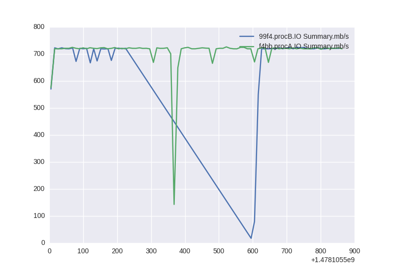
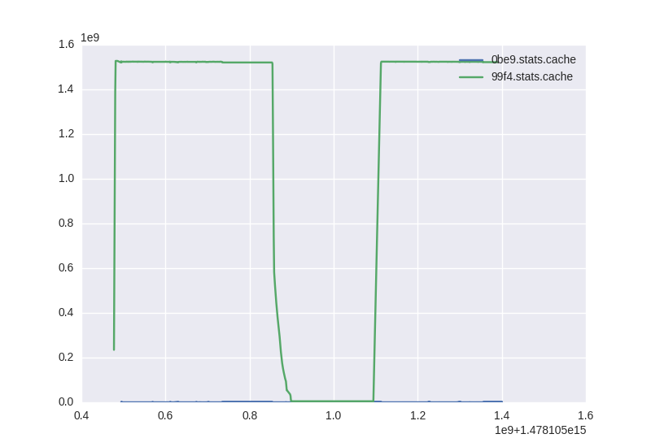

# Perf


# Memory


# Memo
```
../../../../csv2img.py <(grep -E 'IO.*mb' <(cat data/*/perf.csv) | cat <(echo 'x,y,label') -) perf.png
../../../../csv2img.py <(grep -E '0be9\.stats\.cache|99f4\.stats\.cache|f4bb\.stats\.rss$' <(cat data/*/memory.csv) | cat <(echo 'x,y,label') -) memory.png
```
