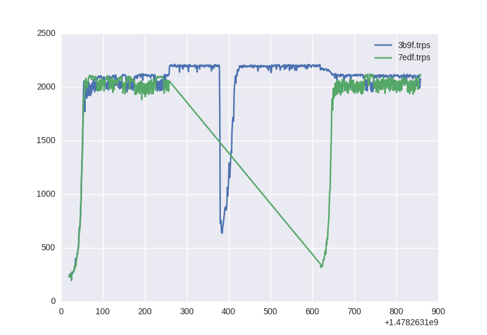
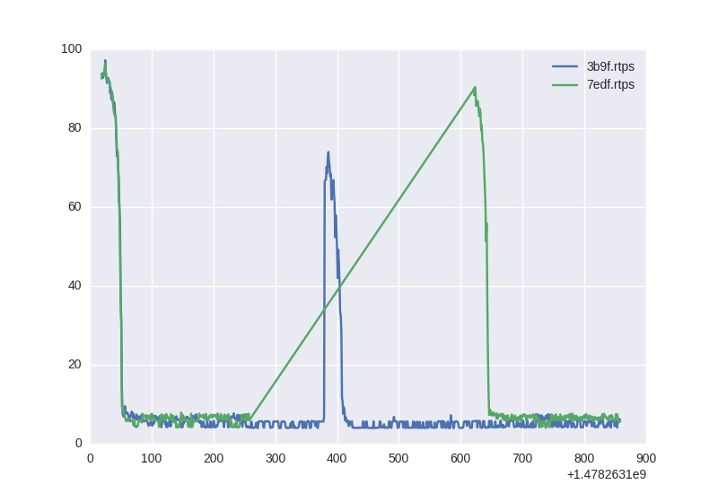
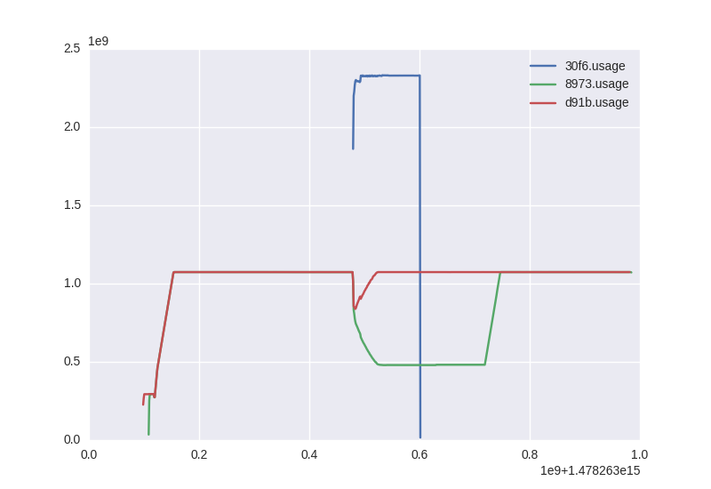

# Perf


# SLA


# Memory


# Memo
```
../../../../../csv2img.py <(grep -E 'trps' <(cat data/*/perf.csv) | cat <(echo 'x,y,label') -) perf.png
../../../../../csv2img.py <(grep -E 'rtps' <(cat data/*/perf.csv) | cat <(echo 'x,y,label') -) sla.png
../../../../../csv2img.py <(grep -E '\.usage' <(cat data/*/memory.csv) | cat <(echo 'x,y,label') -) memory.png
```
